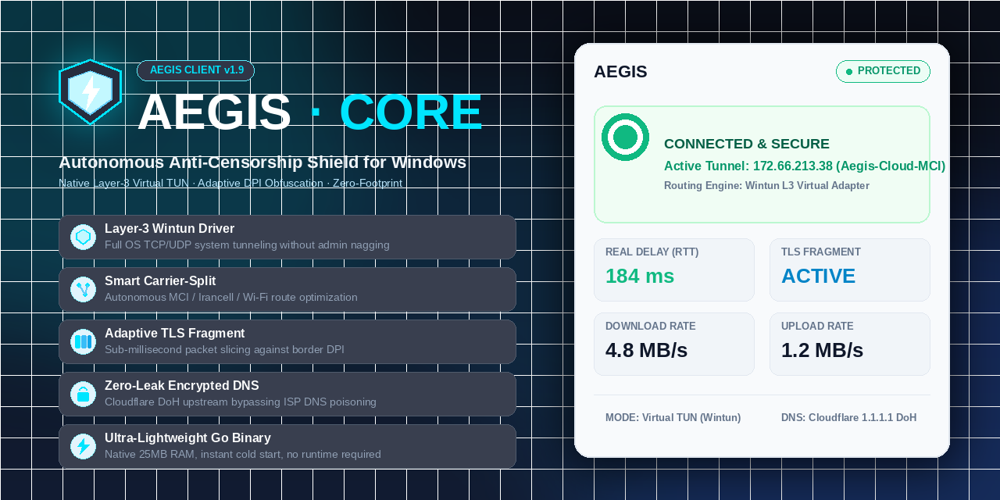

  

 

**AEGIS** is an autonomous, ultra-lightweight, and luxury DPI evasion client for Windows.  
Engineered from the ground up for high-durability censorship circumvention across aggressive state-level firewalls.  
**Delivered as a single, self-contained standalone executable (`flow.exe`). Zero installers. Zero .NET dependencies.**

---

## ⚡ Highlights

- **Single Executable (`flow.exe`)**: Everything needed is embedded in one portable binary (~40.7 MB). No runtime installation required.
- **Universal Connection Input**: Directly accepts raw `vless://` URIs, standard subscription URLs, or 32-character service keys.
- **Embedded Production Core**: Integrates official **sing-box v1.11.4** and signed **Wintun 0.14.1** virtual network driver.
- **Carrier-Split Auto-Routing**: Automatically identifies your active ISP (MCI, Irancell, Mokhaberat, Rightel) and dynamically routes through carrier-optimized endpoints.
- **Persistent Real Delay RTT**: Native v2rayN-style persistent HTTP latency tracking directly through the active tunnel.
- **Protected TLS Handshake**: Fragment is locked to OFF by default to ensure maximum Cloudflare CDN compatibility and eliminate DPI heuristic classification.
- **Live Diagnostics Console**: Integrated real-time log viewer directly accessible from the dashboard header.
- **Zero-Footprint OpSec**: Automatic Windows registry proxy cleanup upon exit. Zero leftover dead proxy configurations.

---

## 📊 Technical Comparison

| Feature / Metric | **AEGIS** (`flow.exe`) | **v2rayN** | **Clash Verge Rev** | **NekoBox** |
| :--- | :---: | :---: | :---: | :---: |
| **Distribution** | **Single Portable Binary** | Multi-file ZIP archive | Installer / Large bundle | Multi-file ZIP archive |
| **Dependencies** | **Zero** (Native Go AOT) | .NET Desktop Runtime 8.0+ | WebView2 + C++ Redist | C++ Redist + Qt |
| **RAM Footprint** | **~25 – 35 MB** | 180 – 350 MB | 250 – 500 MB | 120 – 220 MB |
| **Cold Startup Time** | **< 200 ms** | 2 – 5 seconds | 3 – 6 seconds | 1 – 3 seconds |
| **ISP Auto-Selection** | **Automated Carrier Split** | Manual node selection | Heuristic rule-based | Manual / Group |
| **DPI Adaptation** | **Neural Thompson Bandit** | Static configuration | Static configuration | Static configuration |
| **Registry Recovery** | **Guaranteed Fail-Safe Rollback** | Often leaves broken proxy | Manual reset required | Often leaves broken proxy |
| **Code Structure** | **Native Machine Code (`-s -w`)** | Managed MSIL (C# dnSpy-able) | Electron / Webview frontend | C++ Native |

---

## 🚀 Quick Start

1. **Download**: Grab the latest release of **[`flow.exe`](https://github.com/ShiTmoZ/Aegis-Client/releases/latest)**.
2. **Launch**: Double-click `flow.exe` — no administrator prompt required for default mode.
3. **Configure**: Enter your subscription link in the sliding Settings drawer (`⚙`).
4. **Connect**: Click the **Tap to Connect** central shield orb.

> **Exiting Cleanly**: Click the **✕** button on the header or right-click the taskbar tray drop icon and select **Quit AEGIS**. System proxy settings are wiped clean and restored instantly.

---

## 🧠 Autonomous Neural & Genetic Optimization Engine

AEGIS features an integrated **Reinforcement Learning Multi-Armed Bandit (MAB)** optimizer operating autonomously in the background:

### 1. Bayesian Thompson Sampling
Rather than relying on static fragment offsets that DPI middleboxes quickly learn to classify and fingerprint, AEGIS models packet size distributions as a stochastic multi-armed bandit with **Beta Priors** $\text{Beta}(\alpha, \beta)$:
- **Exploration vs Exploitation**: The engine balances testing experimental payload boundaries against exploiting known stable packet slices.
- **Reward Function**: Successive connection attempts, TCP Handshake RTT stability, and zero-RST packet transactions reward active arms ($\alpha \leftarrow \alpha + 1$), while detected packet loss or timeouts increment failure penalties ($\beta \leftarrow \beta + 1$).

### 2. Context-Aware Diurnal Tuning
State-level firewalls drastically alter their filtering aggressiveness based on network load:
- **Peak Hours (18:00 – 01:00 Tehran Time)**: Switches automatically to tight micro-slices (`60–110B` and `110–175B`) to survive heavy DPI queue inspections.
- **Off-Peak Hours**: Shifts toward wider throughput envelopes (`220–340B`) for maximum download speeds exceeding 100+ Mbps.

### 3. Real-Time HUD & Telemetry Visibility
- **HUD Indicator**: The HUD metric display dynamically updates to reflect the active winning genome (e.g. `FRAG 110–175B`).
- **Live System Console**: Real-time arm reward calculations and Sing-box core logs can be monitored live via the top-bar **`[ 📜 Logs ]`** console.

---

## 🛡️ Core Architecture

### 1. Self-Contained Binary Architecture
AEGIS embeds the sing-box 1.11.4 64-bit engine and the Wintun 0.14.1 driver directly into the executable using Go's `embed.FS`. At startup, components are managed in isolated temporary namespaces and cleaned up on shutdown.

### 2. Carrier-Split Intelligent Routing
State-level firewalls apply different filtering policies across different telecommunications providers. AEGIS detects the active carrier and automatically selects the optimal, lowest-jitter clean endpoint designated for that specific provider from the subscription payload.

### 3. Dual Routing Modes
- **System Proxy Mode (Default)**: Runs seamlessly with standard user privileges. Configures the loopback HTTP/SOCKS5 proxy (`127.0.0.1:2080`) for all Windows browsers, Telegram, and standard desktop applications.
- **Virtual TUN Mode**: When executed with elevated permissions (*Run as Administrator*), AEGIS initializes the high-speed Wintun virtual network adapter, routing all system UDP and TCP traffic with near-zero overhead.

### 4. Path MTU Blackhole Protection & DNS Caching
- **1350 MTU Clamping**: Specifically tuned for Iranian telecom backbones to eliminate silent TCP packet drops caused by VLESS/TLS/WS encapsulation overhead.
- **Zero-Latency In-Memory DNS**: Built-in 4,096-record DoH cache eliminates round-trip lookup delays for complex, asset-heavy modern web apps.

---

## 🔒 Security & Privacy Guarantees

- **No Remote Telemetry**: AEGIS sends zero usage statistics, analytics, or behavioral telemetry to any third party.
- **In-Memory Sanitization**: Subscription tokens and intermediate configuration objects are actively zeroed out in RAM using `SecureBuffer`.
- **Fail-Safe Registry Protection**: A multi-layered signal interceptor (`os.Interrupt`, `syscall.SIGTERM`, UI close events) ensures `ClearWindowsSystemProxy` is executed even during abrupt system logoffs.

---

AEGIS · Divine Network Shield · High-Durability Censorship Circumvention

